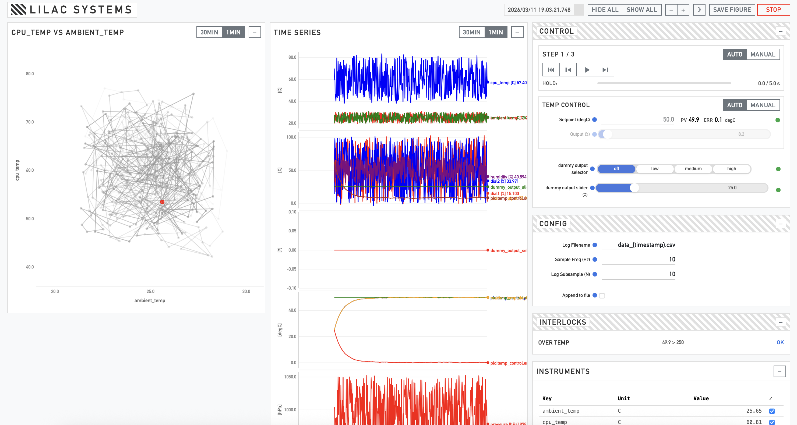

# Lilac Systems

Config-driven experiment control and monitoring dashboard. Real-time plotting, PID control, safety interlocks, step sequences, and CSV logging. Runs on a Raspberry Pi or any machine with Python.



## Setup

Requires **Python 3.9+**.

```bash
git clone https://github.com/lvenneri/lilac_systems.git
cd lilac_systems
python3 -m venv venv
source venv/bin/activate          # Windows: venv\Scripts\activate
pip install -r requirements.txt
```

> **Tip:** On some systems use `pip3` instead of `pip`. On Windows use `python` instead of `python3`.

## Run

```bash
cd sensor_app
python app.py                              # example_config.xlsx, opens browser
python app.py my_experiment.xlsx           # custom config
python app.py --port 8080                  # different port
python app.py --no-browser                 # headless (navigate to http://<ip>:5001)
python app.py --validate-only my.xlsx      # check config without starting
```

CSV files are written next to the config file. Use **Save Figure** in the header to export a time-series PNG and page screenshot. **Stop** saves figures, finalizes the CSV, and shuts down the server.

## Config

Everything lives in a single `.xlsx` file with these sheets:

| Sheet | Purpose |
|-------|---------|
| **Instruments** | Devices or simulated sources — type, address, poll rate |
| **Channels** | I/O signals — name, direction, units, calibration, range |
| **Control Loops** | PID — PV, setpoint, output, gains, auto/manual mode |
| **Interlocks** | Safety rules — channel, condition, threshold, action |
| **Logging** | Channels to log and display, alarm thresholds |
| **Settings** | Sample rate, buffer size, CSV filename, scatter plot channels |

Copy `example_config.xlsx` and edit to match your setup.

```
Instruments ──1:N──> Channels ──referenced by──> Control Loops
                                                  Interlocks
                                                  Logging
```

Config is validated automatically on startup (or standalone with `--validate-only`). Validation checks cross-references between sheets, verifies driver types exist in the registry, and catches missing or invalid fields. Errors block startup; warnings are printed but allowed.

## Dashboard

- **Time series** — per-unit subplots, 1min/30min window toggle, smooth interpolation
- **Scatter plot** — configurable X/Y channels (set in Settings sheet)
- **PID controls** — setpoint, mode (auto/manual), manual output override
- **Step series** — auto/manual sequencing with settle detection and hold timers
- **Output controls** — sliders and segmented buttons for output channels
- **Interlocks** — live status with visual alarm on trip
- **Header** — server-synced clock, panel visibility, font size, dark mode, save figure, stop

## Custom Drivers

Extend `DriverBase` in `sensor_app/driver_base.py`:

```python
class MyDriver(DriverBase):
    def connect(self):                        ...
    def read_channel(self, channel_id):       ...
    def write_channel(self, channel_id, val): ...
    def close(self):                          ...
```

Register in `DRIVER_REGISTRY` and set `Type` in the Instruments sheet.

See [sensor_app/README.md](sensor_app/README.md) for column-by-column details and API endpoints.

## Network Access

```bash
# Pi IP address
ifconfig | grep "inet " | grep -v 127.0.0.1

# Copy files from Pi
scp -r user@<pi-ip>:/home/user/lilac_systems ./
```
